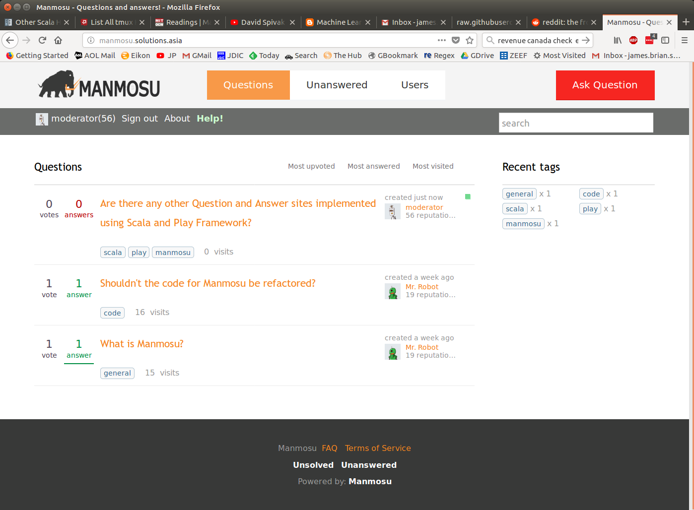

Manmosu Q&A - beta
======


[Click here to visit Manmosu Demo Site](https://manmosu.solutions.asia)
---------- 


## What is Manmosu (マンモス)?

It is a remake of the [Mamute Question and Answer site](https://github.com/caelum/mamute).
Manmosu only implements the Question and Answer functionality not the News feed part of Mamute.
The project is implemented in Scala using the Play Framework, Slick for DB access and Silhouette for the authentication library.
Manmosu supports more social login providers than the original Mamute thanks to [Silhouette](https://www.silhouette.rocks/).
The project currently uses the original database schema and keeps the same urls so existing projects can be easily migrated.





## How to

 set up an instance of Manmosu

Manmosu requires [Java](https://openjdk.java.net/), [MySQL](https://dev.mysql.com/downloads/mysql/) and Scala [SBT](https://www.scala-sbt.org/download.html) to be installed and set up.   

download Manmosu
```
git clone https://github.com/JamesSullivan/manmosu.git
cd manmosu
```

New Users
---------- 

Set up a new database (script is for Linux bash but is simple enough to follow manually for other OSes).
You will need to input your MySQL database password if set up. If you are on Ubuntu 18.04 you should remove the -p from the second line of the script and run it as root.
```
chmod o+x ./setupdb.sh
./setupdb.sh
```
To view the site
`sbt run` and then point your browser to [http://localhost:9000](http://localhost:9000)


Users migrating from an existing Mamute installation
-----------

Backup your existing db and files (Manmosu is untested software and could have bugs that corrupt your data)

Change the conf/application.conf configuration file to match your database (near the end of the file)
```
slick.dbs.default.db.url="jdbc:mysql://localhost/manmosu?allowPublicKeyRetrieval=true&useSSL=false"
slick.dbs.default.db.user=manmosu_user
slick.dbs.default.db.password="manmosupw!"
```

In an effort to cut down on dependencies, Manmosu uses MySQL for text indexing not Solr. If you want to have internal search (optional) you will need to run the following at a MySQL command line: `CREATE FULLTEXT INDEX title_text ON QuestionInformation (title,description)`. 

If you at some point changed the SALT in your Mamute src/main/java/org/mamute/infra/Digester.java file you will also need to change it in Manmosu app/utils/Digester.scala to match.

To view the site
`sbt run` and then point your browser to [http://localhost:9000](http://localhost:9000)


E-mail, Adding Social Logins such as Facebook, Google, etc.
-----------

To use E-mail the appropriate settings must be changed in conf/application.conf (?MAILHOST, ?MAILUSER and ?MAILPASSWORD get variables from environment instead if set)
```
play.mailer {
    host="smtp.gmail.com"
    #get host from environment variable if set
	host = ${?MAILHOST}   
	user="manmosu.qanda@gmail.com"
	user = ${?MAILUSER}
	password="thisPasswordWontWork"
	password = ${?MAILPASSWORD}
	from="manmosu.qanda@gmail.com"
    from = ${?MAILUSER}
	port=465
	tls=true
	ssl=true
	debug=true
}
```

If you want to require new users to confirm by E-mail change `feature.emailsignup=false` to true

To allow social logins such as Facebook, Google, etc. change from line 151 of app/modules/SilhouetteModule.scala as well as adding credentials to the conf/silhouette.conf cconfiguration file.
